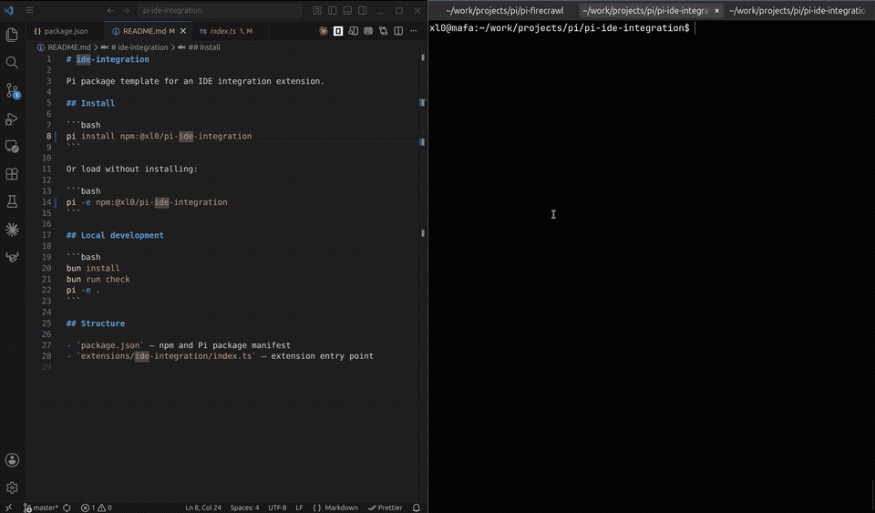

# ide-integration

Pi package template for an IDE integration extension.

[](https://github.com/xl0/pi-ide-integration/releases/download/demo/demo.mp4)

## Install

```bash
pi install npm:@xl0/pi-ide-integration
```

Or load without installing:

```bash
pi -e npm:@xl0/pi-ide-integration
```

## Local development

```bash
bun install
bun run check
pi -e .
```

## Structure

- `package.json` — npm and Pi package manifest
- `extensions/ide-integration/index.ts` — extension entry point
